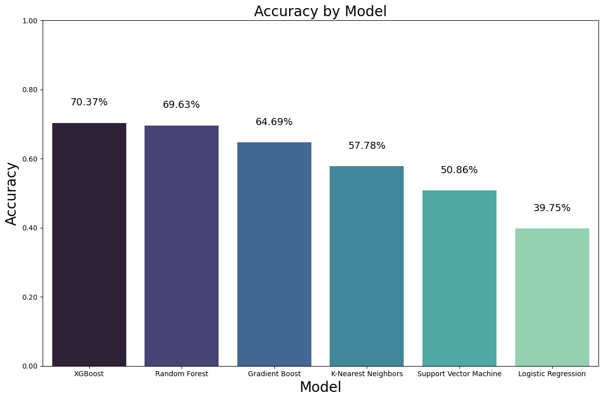

# Corporate Credit Rating Forecast using Machine Learning Methods

- **The Problem** Corporate credit ratings, issued by credit rating agencies like Standard & Poor's and Moody's, express the agency's opinion about the ability of a company to meet its debt obligations. Each agency applies its own methodology to measure creditworthiness and this assessment is an expensive and complicated process. Usually, the agencies take time to provide new ratings and update older ones. This causes delays in decision-making process for investors who use these ratings to assess their credit risk. 

- **Solution** One solution to address delays would be to use the historical financial information of a company to build a predictive quantitative model capable of forecasting the credit rating that a company will receive. I employed machine learning techniques, creating classification models that quickly forecast credit ratings. 

- **Applications** The insights gained can aid financial analysts, investors, and companies in making more informed and quick decisions related to credit risk. The classification methods used here can also be used to forecast other ratings like ESG Ratings.

- **Skills** Explored classification methods like XGBoost, RandomForest and techniques to address imbalance in datasets - SMOTE. Also delved into Financial Ratios gaining knowledge on understanding a company's fiscal strength.

## Dataset

The [Corporate Credit Rating](https://www.kaggle.com/datasets/agewerc/corporate-credit-rating/data) dataset is obtained from Kaggle .
This dataset comprises 2029 credit ratings assigned by major agencies to prominent US firms traded on NYSE or Nasdaq. The ratings span the period from 2010 to 2016. Each entry encompasses 30 features, with 25 being financial indicators. 

[Exploratory Data Analysis and Data Preparation Notebook](exploratory-data-analysis.ipynb)

## Methods

The following machine learning models were implemented and hyperparameter optimisation was performed using RandomizedSearchCV with StratifiedKFold for cross-validation. 

 [ML Models Implementation Notebook](machine-learning-methods.ipynb)

1. Logistic Regression
2. KNN
3. SVM
4. Random Forest
5. Gradient Boost
6. XGBoost

## References

1. Parisa Golbayani, Ionuţ Florescu, Rupak Chatterjee:
A comparative study of forecasting corporate credit ratings using neural networks, support vector machines, and decision trees. _The North American Journal of Economics and Finance,
Volume 54, 2020_, https://doi.org/10.1016/j.najef.2020.101251.

2. https://www.kaggle.com/datasets/agewerc/corporate-credit-rating/